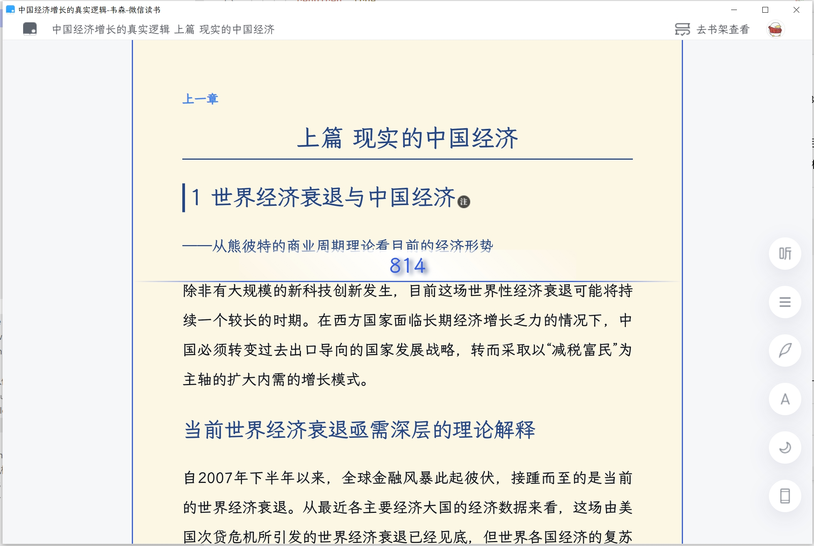
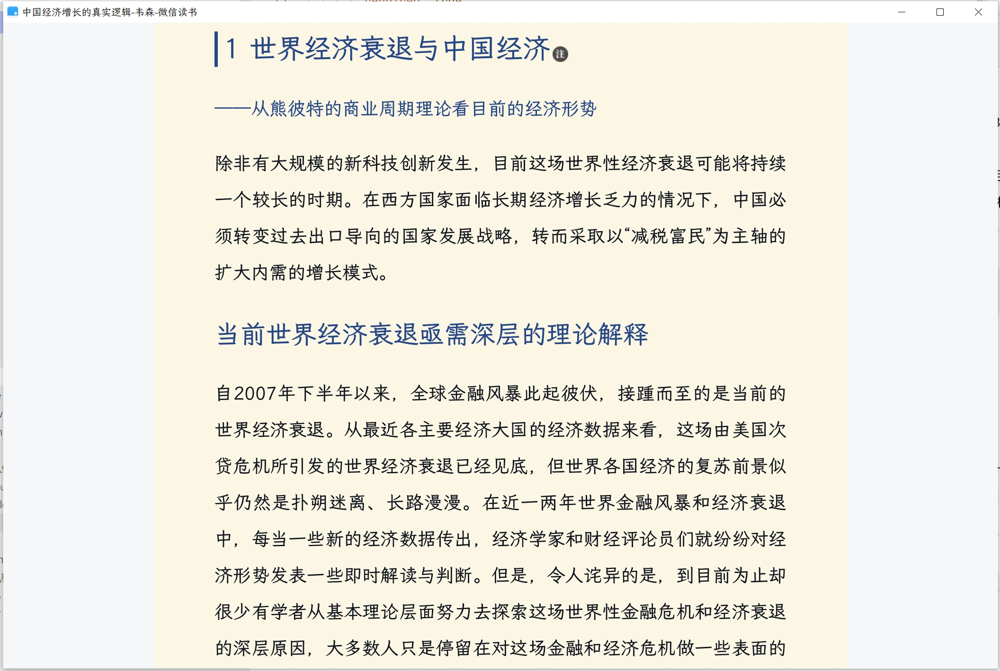

基于 [Pake](https://github.com/tw93/Pake/) 打包的微信读书PC客户端，支持windows、macos、linux。

包体积极小: windows[3.86M], mac[7.97M]

已有功能：
- [x] 霞鹜文楷字体
- [x] 阅读背景颜色修改
- [x] 支持拖拽修改阅读宽度
- [x] 支持隐藏按钮，沉浸式阅读 

待开发：
- [ ] 全屏按钮
- [ ] 自定义字体
- [ ] 自定义背景色
- [ ] 自定义背景图片

 
字体修改：

 
支持手动拖拽宽度：

 
滚动自动隐藏其他元素：

---
感谢 [Pake](https://github.com/tw93/Pake/) 封装的基础能力。